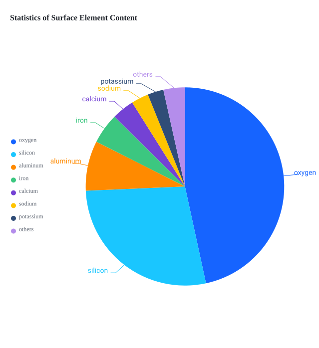

<div align="center">
  <a href="https://github.com/VisActor#gh-light-mode-only" target="_blank">
    
  </a>
  <a href="https://github.com/VisActor#gh-dark-mode-only" target="_blank">
    
  </a>
</div>

<div align="center">
  <h1>vchart-svg-plugin</h1>
</div>

<div align="center">

vchart-svg-plugin 是 vchart 插件，用于将 vchart 渲染后的内容转换成 svg，方便在打印、SSR 等环境下使用


[](https://www.npmjs.com/package/@visactor/vchart-svg-plugin)
[](https://www.npmjs.com/package/@visactor/vchart-svg-plugin)
[](https://github.com/visactor/vchart-svg-plugin/blob/main/CONTRIBUTING.md#your-first-pull-request)

 [](https://github.com/visactor/vchart-svg-plugin/blob/main/LICENSE)

</div>

<div align="center">

[English](./README.md) | 简体中文

</div>

## 简介

VChart 是 VisActor 可视化体系中的图表组件库，基于 vchart-svg-plugin，可以轻松的将图表转换成 svg 文件

## 🔨 使用

### 📦 安装

```bash
# npm
$ npm install @visactor/vchart-svg-plugin

# yarn
$ yarn add @visactor/vchart-svg-plugin
```

### 📊 一个简单的图表

<div>
  
</div>

```typescript
import VChart from "@visactor/vchart";
import { convertVChartToSvg } from "@visactor/vchart-svg-plugin";

const spec = {
  type: "pie",
  data: [
    {
      id: "id0",
      values: [
        { type: "oxygen", value: "46.60" },
        { type: "silicon", value: "27.72" },
        { type: "aluminum", value: "8.13" },
        { type: "iron", value: "5" },
        { type: "calcium", value: "3.63" },
        { type: "sodium", value: "2.83" },
        { type: "potassium", value: "2.59" },
        { type: "others", value: "3.5" },
      ],
    },
  ],
  outerRadius: 0.8,
  valueField: "value",
  categoryField: "type",
  title: {
    visible: true,
    text: "Statistics of Surface Element Content",
  },
  legends: {
    visible: true,
    orient: "left",
  },
  label: {
    visible: true,
  },
  tooltip: {
    mark: {
      content: [
        {
          key: (datum) => datum["type"],
          value: (datum) => datum["value"] + "%",
        },
      ],
    },
  },
};

const vchart = new VChart(spec, {
  dom: "chart-container",
  animation: false, // 注意，不要开启动画，不然需要监听动画结束事件，再进行svg转换
});
vchart.renderSync();

const svgContent = convertVChartToSvg(vchart);
```

### node 端渲染

```typescript
const VChart = require("@visactor/vchart");
const Canvas = require("canvas");
const { convertVChartToSvg } = require("@visactor/vchart-svg-plugin");

const spec = {
  type: "pie",
  data: [
    {
      id: "id0",
      values: [
        { type: "oxygen", value: "46.60" },
        { type: "silicon", value: "27.72" },
        { type: "aluminum", value: "8.13" },
        { type: "iron", value: "5" },
        { type: "calcium", value: "3.63" },
        { type: "sodium", value: "2.83" },
        { type: "potassium", value: "2.59" },
        { type: "others", value: "3.5" },
      ],
    },
  ],
  outerRadius: 0.8,
  valueField: "value",
  categoryField: "type",
  title: {
    visible: true,
    text: "Statistics of Surface Element Content",
  },
  legends: {
    visible: true,
    orient: "left",
  },
  label: {
    visible: true,
  },
  tooltip: {
    mark: {
      content: [
        {
          key: (datum) => datum["type"],
          value: (datum) => datum["value"] + "%",
        },
      ],
    },
  },
};

const vchart = new VChart(spec, {
  // 声明使用的渲染环境以及传染对应的渲染环境参数
  mode: "node",
  modeParams: Canvas,
  animation: false,
});
vchart.renderSync();

const svgContent = convertVChartToSvg(vchart);
```

## �️ 开发

### 环境搭建

```bash
# 克隆仓库
git clone https://github.com/visactor/vchart-svg-plugin.git
cd vchart-svg-plugin

# 安装依赖
yarn install

# 启动开发服务器
yarn dev

# 构建生产版本
yarn build

# 运行代码检查
yarn lint
```

### 项目结构

```
vchart-svg-plugin/
├── src/                          # 源代码
│   ├── svg/                      # SVG转换模块
│   │   ├── arc.ts               # 弧形转换
│   │   ├── area.ts              # 区域形状转换
│   │   ├── convert.ts           # 主要转换逻辑
│   │   ├── graphic.ts           # 基础图形转换
│   │   ├── group.ts             # 分组元素转换
│   │   ├── line.ts              # 线条转换
│   │   ├── pattern.ts           # 图案转换
│   │   ├── polygon.ts           # 多边形转换
│   │   ├── rect.ts              # 矩形转换
│   │   ├── shadow.ts            # 阴影效果
│   │   ├── symbol.ts            # 符号转换
│   │   └── util.ts              # 工具函数
│   └── index.ts                 # 主入口文件
├── demo/                         # 示例应用
│   ├── src/                     # 示例源代码
│   ├── index.html               # 示例HTML
│   └── vite.config.ts           # Vite配置
├── package.json                 # 项目依赖和脚本
├── rollup.config.js            # Rollup构建配置
├── tsconfig.json               # TypeScript配置
└── README.zh-CN.md             # 中文文档
```

### 核心模块

#### SVG转换模块

该插件通过专门的模块将VChart渲染的图形转换为SVG：

- **convert.ts**: 主要转换入口和协调逻辑
- **graphic.ts**: 基础图形元素转换逻辑
- **arc.ts**: 弧形和饼图片段转换
- **line.ts**: 线条和路径元素转换
- **rect.ts**: 矩形和圆角矩形转换
- **area.ts**: 面积图和多边形转换
- **symbol.ts**: 符号和标记转换
- **pattern.ts**: 图案和渐变转换
- **shadow.ts**: 阴影效果转换
- **group.ts**: 分组元素处理
- **util.ts**: SVG生成的工具函数

### 开发流程

1. **本地开发**
   ```bash
   # 启动示例服务器
   yarn dev
   
   # 示例应用将在 http://localhost:5173 可访问
   ```

2. **代码规范**
   - 使用TypeScript保证类型安全
   - 遵循ESLint配置
   - 保持一致的代码格式

3. **构建**
   ```bash
   # 构建所有格式（ESM、CJS、UMD）
   yarn build
   
   # 输出将位于：
   # - esm/     (ES模块)
   # - cjs/     (CommonJS)
   # - umd/     (UMD包)
   ```

4. **测试**
   - 运行示例应用测试更改
   - 验证SVG输出质量
   - 测试不同的图表类型

### API参考

#### 主要函数

##### `convertVChartToSvg(vchart: VChart): string`

将渲染后的VChart实例转换为SVG字符串。

**参数：**
- `vchart`: 已渲染的VChart实例

**返回值：**
- `string`: SVG内容字符串

**示例：**
```typescript
import VChart from "@visactor/vchart";
import { convertVChartToSvg } from "@visactor/vchart-svg-plugin";

const vchart = new VChart(spec, { dom: "container" });
vchart.renderSync();

const svgContent = convertVChartToSvg(vchart);
console.log(svgContent); // SVG字符串输出
```

#### 使用说明

- **动画**: 转换时禁用动画（`animation: false`）以确保准确的SVG输出
- **Node.js**: 对于服务器端渲染，使用`mode: "node"`并提供canvas实现
- **性能**: 大型图表可能需要更长时间转换；对于复杂可视化考虑使用`renderAsync()`

#### 环境支持

- **浏览器**: 完全支持基于DOM的VChart
- **Node.js**: 通过canvas后端支持（例如`canvas`包）
- **SSR**: 与服务器端渲染工作流兼容

### 贡献

1. Fork该仓库
2. 创建功能分支
3. 进行更改
4. 通过示例彻底测试
5. 确保代码通过linting
6. 提交pull request

有关详细的贡献指南，请参阅[CONTRIBUTING.zh-CN.md](./CONTRIBUTING.zh-CN.md)

## �🔗 相关链接

- [主页](https://www.visactor.io/vchart)
- [VCharts 图表示例](https://www.visactor.io/vchart/example)
- [VChart 图表教程](https://www.visactor.io/vchart/guide/tutorial_docs/VChart_Website_Guide)
- [VChart 图表配置项](https://www.visactor.io/vchart/option/)
- [VChart API](https://www.visactor.io/vchart/api/API/vchart)
- [VGrammar](https://www.visactor.io/vgrammar)
- [VRender](https://www.visactor.io/vrender)
- [FAQ](https://www.visactor.io/vchart/guide/tutorial_docs/FAQ)
- [CodeSandbox 模板](https://codesandbox.io/s/the-template-of-visactor-vchart-vl84ww?file=/src/index.ts) 用于 bug 的提交

## 🤝 参与贡献 [](https://github.com/visactor/vchart-svg-plugin/blob/main/CONTRIBUTING.md#your-first-pull-request)

如想参与贡献，请先阅读[行为准则](./CODE_OF_CONDUCT.md) 和[贡献指南](./CONTRIBUTING.zh-CN.md)。

细流成河，终成大海！

<a href="https://github.com/visactor/vchart-svg-plugin/graphs/contributors"></a>
